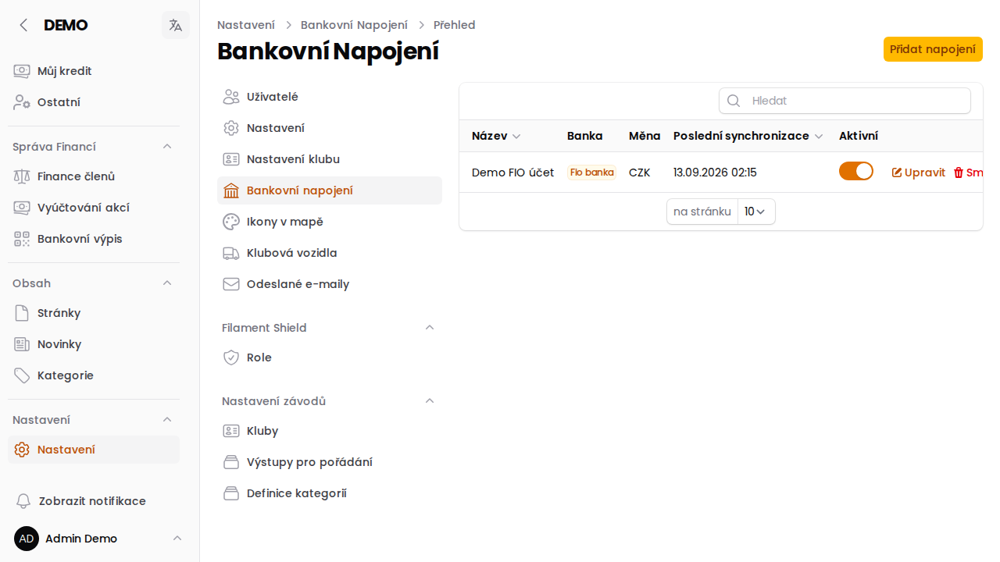

# Bankovní napojení

Stránka **Nastavení → Bankovní napojení** (`/admin/config/bank-accounts`) je přehled bankovních účtů, ze kterých
aplikace automaticky stahuje a páruje platby (typicky členské příspěvky) — viz [Bankovní výpis](/napoveda/bankovni-vypis).

Pro každé napojení se v přehledu zobrazuje název, banka (konektor), měna, čas poslední synchronizace a přepínač
**Aktivní** — transakce se stahují jen z aktivních napojení.

:::info{title="Podrobný návod"}
Založení nového napojení, podporované konektory (Moneta Money Bank, Fio banka) a jak fungují šifrovaná
přístupová hesla popisuje instalační dokumentace: **[Napojení na banku](/install/bank-connector)**.
:::
