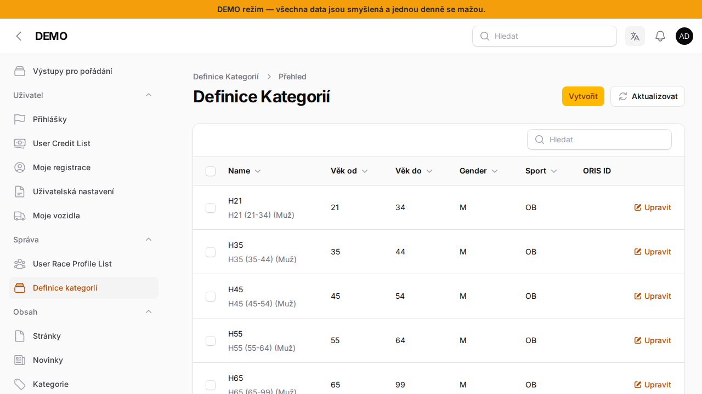

# Definice kategorií

Stránka **Definice kategorií** obsahuje číselník sportovních kategorií (např. `H21`, `D35`) používaných u [závodů](/napoveda/stranka-zavody-akce) a v [profilech závodníků](/napoveda/member-race-profile) — věkovou skupinu, pohlaví a sport, pro který kategorie platí.

## Co záznam obsahuje

- **Name** — kód kategorie (např. `H21`)
- **Věk od** / **Věk do**
- **Gender** — `M` (muž), `F` (žena) nebo `A` (vše)
- **Sport** — sport, ke kterému kategorie patří
- **ORIS ID** — identifikátor v systému ORIS (needitovatelné, jen pro párování)

## Aktualizace z ORISu

Tlačítkem **Aktualizovat** v hlavičce stránky lze číselník kategorií znovu načíst a sesynchronizovat s ORISem, aby odpovídal aktuálně platným kategoriím české orientační federace.

:::info{title="Kdo má přístup"}
Definice kategorií spravuje **Správce závodů** (případně Super Administrátor). Ruční úpravy zde dělejte jen výjimečně — číselník je primárně udržovaný synchronizací z ORISu.
:::
