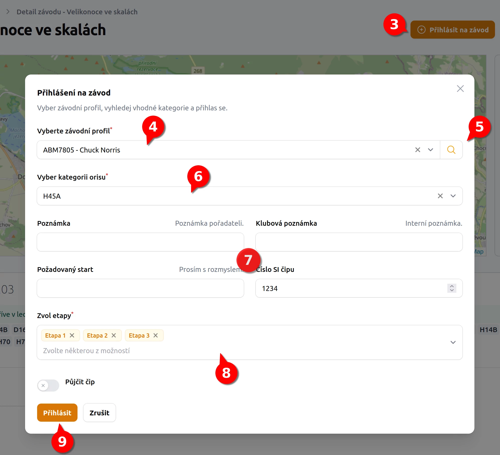
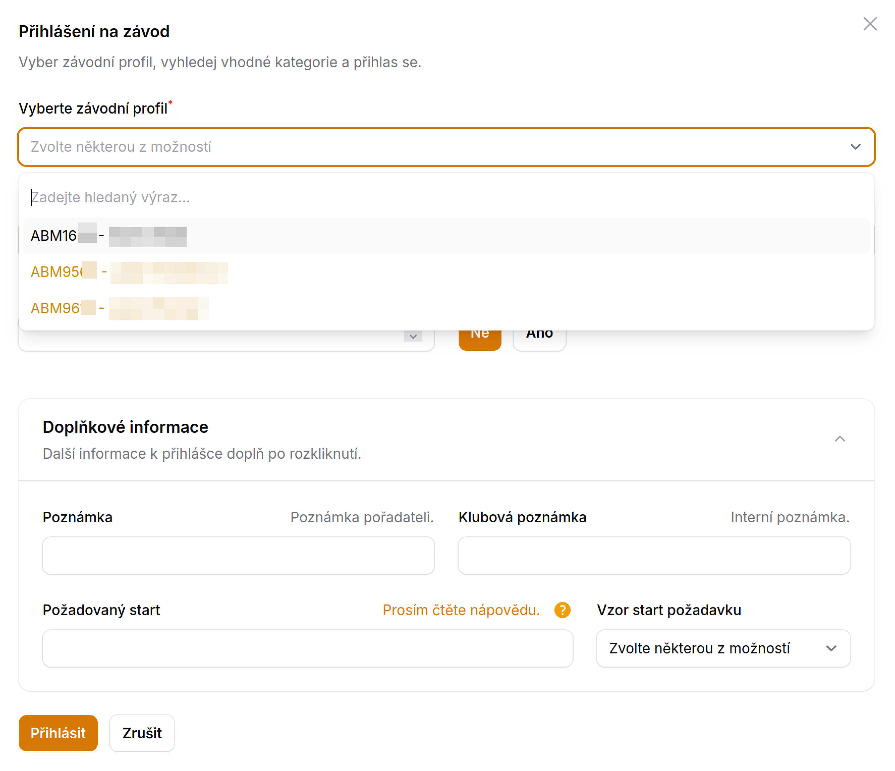

# Jak se přihlásit na závod v ORISu <Badge type="info" text="ČLEN" />

1. V menu **Závod/Akce** přejdu na kalendář závodů.
2. Kliknu na konkrétní závod (kdekoliv na řádku závodu)
3. V kartě závodu vidím potřebné informace o závodu, v pravo nahoře kliknu na tlačítko **Přihlásit na závod**.
4. V otevřeném dialogu zvolím konkrétní registrační číslo závodníka, kterého chci přihlašovat. Pod jedním účtem mohu mít více závodníků.
5. Vyberu konkrétní **kategorii**
6. Doplním číslo SI pokud se nevyplní samo z [profilu závodníka](member-race-profile).
7. Pokud se jedná o etapový závod, jsou v rozvíracím menu automaticky vyplněny všechny etapy
   - Etapy mohu křížkem u Etapy odstranit a budu přihlášen pouze do vybraných Etap.
8. Ostatní údaje 
   - Poznámka pro organizátory
   - Poznámka klubová
   - Požadavky na start - kterou lze doplnit z přepřipraveného vzoru.

:::warning{title="Jedná se pouze o návrh nejčastěji používaných vzorů"}
Konkrétní znění požadavku na start prosím prostudujte v oficiální specifikaci na [stránkách ORISu](https://oris.orientacnisporty.cz/files/help/Pozadovane-starty-prihlasky.pdf)
:::

8. Kliknu na tlačítko **Přihlásit**. Tímto jsem přihlášen k závodu.
9. Případně opakuji od bodu 3. pro dalšího závodníka, v případě, že chci přihlásit více závodníků na jeden závod.

## Co zkontrolovat po přihlášení

1. V sekci **Uživatel** byste měli vidět konkrétní **přihlášení** pod konkrétním závodním profilem.
2. Na stránkách [ORISu](https://oris.orientacnisporty.cz/) si zkontroluji, že **jsem přihlášen**.

## Řešení potíží s přihlášením

- **Na kartě závodu mi nejde kliknout na tlačítko Přihlásit se**

  Pokud je tlačítko pouze šedé, tak to může mít několik důvodů.
  
    - Na závod jsi už přihlášen. Tzn. ve správě není žádný další závodní profil který bys přihlásil do závodu
    - Závod nemá vyplněny kategorie, nelze se se tedy ani přihlásit

:::warning{title="Automatická aktualizace závodů"}
Závody se aktualizují jednou za 7 dnů. Pokud organizátor přidá kategorie na poslední chvíli, nemusí zde být tyto kategorie aktuální.
Postup je takový, že zkontroluješ, jestli má závod vyplněny kategorie na ORISu. Pokud ano, dáš vědět odpovědné osobě,
data závodu zaktualizuje ručně.
:::

## Pokud spravuji závodníky i jinému uživateli

V případě, že vás jiný uživatel [oprávnil jej přihlašovat nebo odhlašovat ze závodů](stranka-uzivatelska-nastaveni), vidíte zároveň
své registrace (**černá barva**) tak závodníky uživatelů, kteří vám k tomu dali souhlas (**oranžová barva**).

Takovéto závodníky můžete ze závodu i [odhlásit](jak-se-odhlasit-ze-zavodu).

