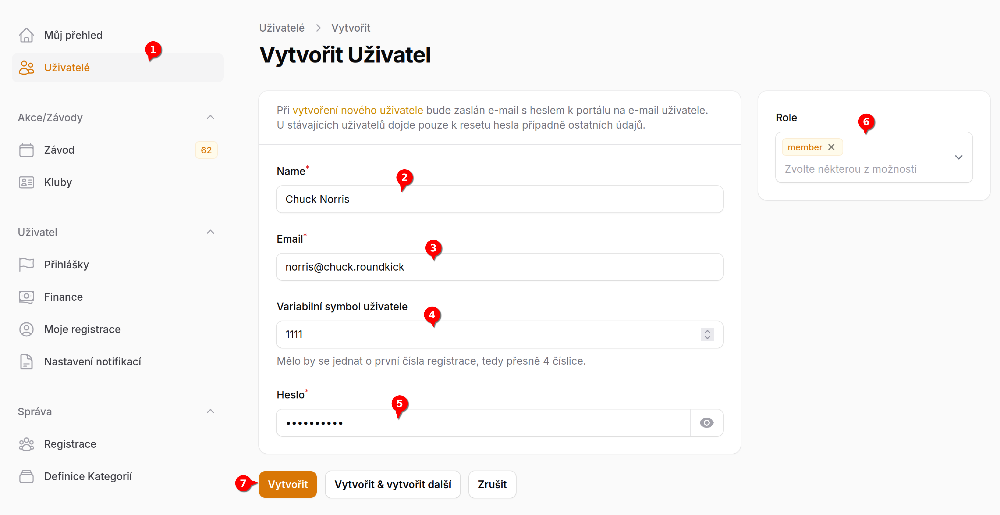
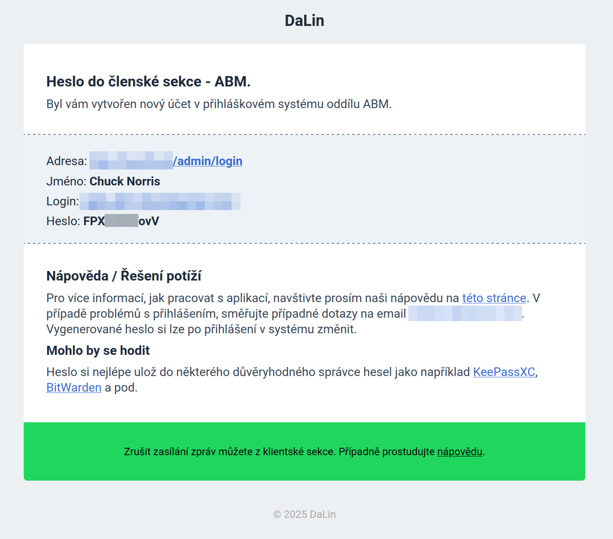

# Jak založit nového uživatele<Badge type="info" text="Admin klubu" />

:::info{title="Nový uživatel"}
Uživatel umožňuje pracovat s klubovým systémem na základě přidělených oprávnění.
:::

1. V menu klikni na odkaz **Uživatel**
2. Vyplňte jméno (bude zobrazeno různě v systému)
3. Vyplňte **e-mailovou adresu**. E-mailová adresa musí být **unikátní** a nesmí být použita v systému vícekrát.
4. Doplníme _variabilní symbol_ (nepovinné). Běžná praxe je použít pro variabilní symbol čtyřčíslí hlavní registrace uživatele. Pokud například moje registrace je  AAA4578 použiji 4578.
5. Necháme předdefinované heslo, případně upravíme. **Doporučujeme nedávat zadávat silná negenerická hesla**.
6. Zvolíme **roli** nebo více **rolí** uživatele v klubovém systému.
7. Uživatele založím.

**Ihned po uložení uživatele bude mít tento přístup do systému.**
Následně bude novému uživateli zaslán uvítací e-mail.

Náhled takového e-mailu vidíte na následujícím obrázku.

## Upravit uživatele

Na stejné stránce je možné kdykoliv uživateli upravit jakékoliv informace. Administrátor může změnit heslo případně změnit jakékoliv informace uživatele.

### Navazující informace uživatele

U existujících uživatelů je možné zkontrolovat **pohyb financí** případně **[seznam registrací](jak-pridat-uzivateli-registraci)** uživatele.

