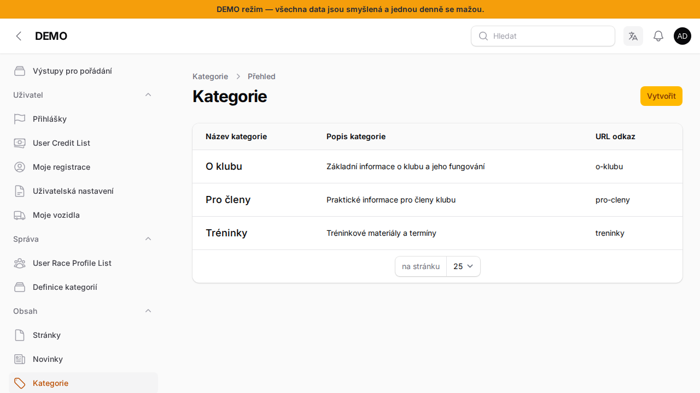

# Kategorie obsahu

Kategorie slouží ke strukturování [Stránek](/napoveda/sprava-stranek) do logických celků — například všechny stránky týkající se jednoho závodu, nebo sekce "Pro členy". Stránky zařazené ve stejné kategorii mohou navzájem zobrazovat menu s odkazy na sebe.

## Založení kategorie

V menu **Obsah → Kategorie** klikni na **Vytvořit** a vyplň:

- **Název** kategorie
- **Slug** — část URL adresy
- **Popis** kategorie
- **Relace na závod/akci** — volitelně lze kategorii svázat s konkrétním závodem/akcí/soustředěním

Následně lze při zakládání či úpravě [stránky](/napoveda/sprava-stranek) tuto kategorii vybrat v poli **Kategorie**.

:::info{title="Kdo má přístup"}
Zakládat a upravovat kategorie obsahu může role **Redaktor** (případně Super Administrátor). Viz [Role v aplikaci](/napoveda/role-v-aplikaci).
:::
