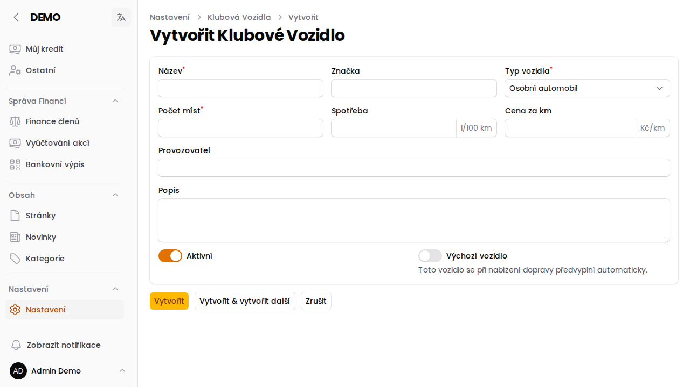

# Klubová vozidla

Stránka **Konfigurace → Klubová vozidla** slouží ke správě vozového parku klubu, který je k dispozici pro **dopravu** na závody a akce (přidělování odvozu členům). Vedle klubových vozidel si může každý člen v sekci **Moje vozidla** přidat i svá vlastní.

## Založení klubového vozidla

Na stránce **Konfigurace → Klubová vozidla** klikni na **Vytvořit** a vyplň:

- **Název** a **Značka** vozidla
- **Typ vozidla** — osobní automobil, dodávka, autobus nebo letadlo
- **Počet míst**
- **Spotřeba** (l/100 km) a **Cena za km** (Kč/km) — volitelné, používají se pro dopočet nákladů na dopravu
- **Provozovatel** a **Popis**
- **Aktivní** — jen aktivní vozidla lze při organizaci dopravy nabídnout
- **Výchozí vozidlo** — toto vozidlo se při nabízení dopravy předvyplní automaticky

:::tip
Vozidlo lze kdykoliv upravit nebo deaktivovat přepínačem **Aktivní** — data zůstanou zachována, jen zmizí z nabídky při plánování dopravy.
:::

:::info{title="Kdo má přístup"}
Klubová vozidla spravuje **Admin klubu** (případně Super Administrátor). Přístup k automobilu není nutný pro přidání *vlastního* vozidla v sekci Moje vozidla — to může kterýkoliv člen.
:::

## Kdo smí klubové vozidlo použít v nabídce dopravy

Klubové vozidlo lze v [nabídce dopravy](/napoveda/doprava-na-zavody) použít jen u závodů s typem dopravy **Doprava zajištěna klubem** nebo **Kombinovaná**, a to jen role Super Administrátor, Admin klubu, Správce závodů a Organizátor závodů. U typu *Doprava zajištěna klubem* smí nabídku vystavit pouze tyto role. Žádost o místo v nabídce může poslat kdokoli včetně role Člen.
