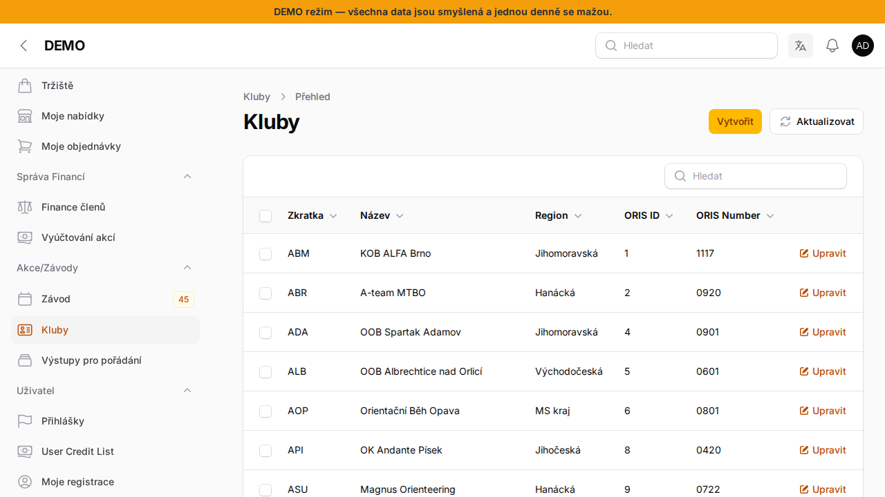

# Kluby

Stránka **Kluby** (v menu pod **Akce/Závody**) je číselník oddílů orientačního běhu — nejde o nastavení *vašeho* klubu, ale o sdílený seznam všech oddílů (typicky v rámci kraje/oblasti), který se používá jinde v systému, například při přiřazování klubu k závodníkovi nebo k závodu.

## Co záznam obsahuje

- **Zkratka** a **Název** oddílu
- **Region** — kraj/oblast, pod kterou oddíl spadá
- **ORIS ID** / **ORIS Number** — needitovatelné identifikátory pro párování s [ORISem](https://oris.orientacnisporty.cz/)

## Aktualizace z ORISu

Tlačítkem **Aktualizovat** v hlavičce stránky lze seznam klubů znovu načíst z ORISu.

:::info{title="Kdo má přístup"}
Číselník klubů spravuje **Super Administrátor**. Ruční úpravy zde dělejte jen výjimečně — seznam je primárně udržovaný synchronizací z ORISu.
:::
