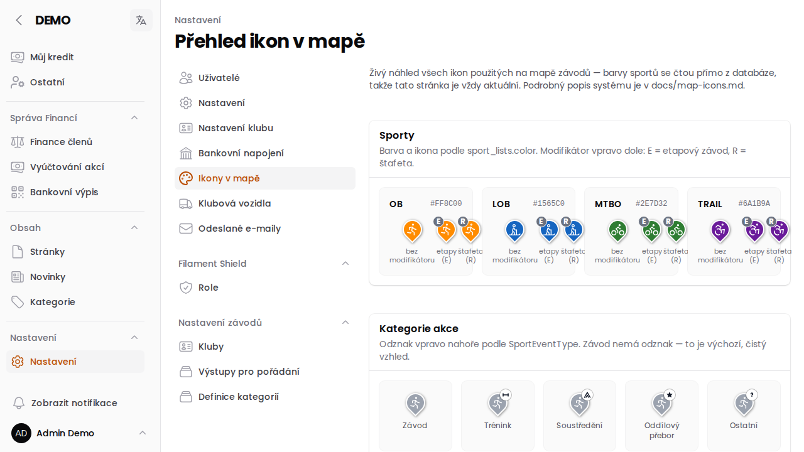

# Ikony v mapě

Na mapách závodů a akcí (například na [Můj přehled](/napoveda/stranka-uzivatelska-nastaveni) nebo v
[přehledu závodů](/napoveda/stranka-zavody-akce)) se každá akce zobrazuje jako barevná ikona (pin).
Barva, tvar a případné odznaky u ikony nejsou náhodné — nesou informaci o sportu, typu závodu a druhu
akce, aniž byste museli klikat na detail.

Stránka **Nastavení → Ikony v mapě** (`/admin/config/map-icon-gallery`) slouží jako živá galerie všech
podob ikon, které se v aplikaci používají — hodí se hlavně správcům, kteří chtějí zkontrolovat, jak
budou ikony vypadat, případně nastavit barvy jednotlivých sportů.

## Barva podle sportu

Základní barva ikony odpovídá sportu, ke kterému akce patří (OB, LOB, MTBO, TRAIL…) — barvu má každý
sport nastavenou v číselníku sportů, takže se dá kdykoliv změnit a projeví se okamžitě na všech
mapách.

## Modifikátor E/R

V pravém dolním rohu ikony se může objevit malé písmenko:

- **E** — jde o **etapový závod** (závod na víc dnů/etap)
- **R** — jde o **štafetu**

Pokud akce není ani etapová, ani štafetová, ikona žádný modifikátor nemá.

## Odznak kategorie akce

V pravém horním rohu ikony se podle typu akce zobrazuje malý odznak:

- **Trénink**
- **Soustředění**
- **Oddílový přebor**
- **Ostatní**

Běžný **závod** je výchozí, nejčastější případ — ten žádný odznak nemá, aby na mapě nejvíc vynikal.

:::info{title="Kdo má přístup"}
Stránku Ikony v mapě uvidí uživatelé s příslušným oprávněním v Nastavení — typicky **Super
Administrátor** a **Správce závodů**. Slouží primárně jako kontrolní/QA přehled, žádná data se tu
needituje.
:::
