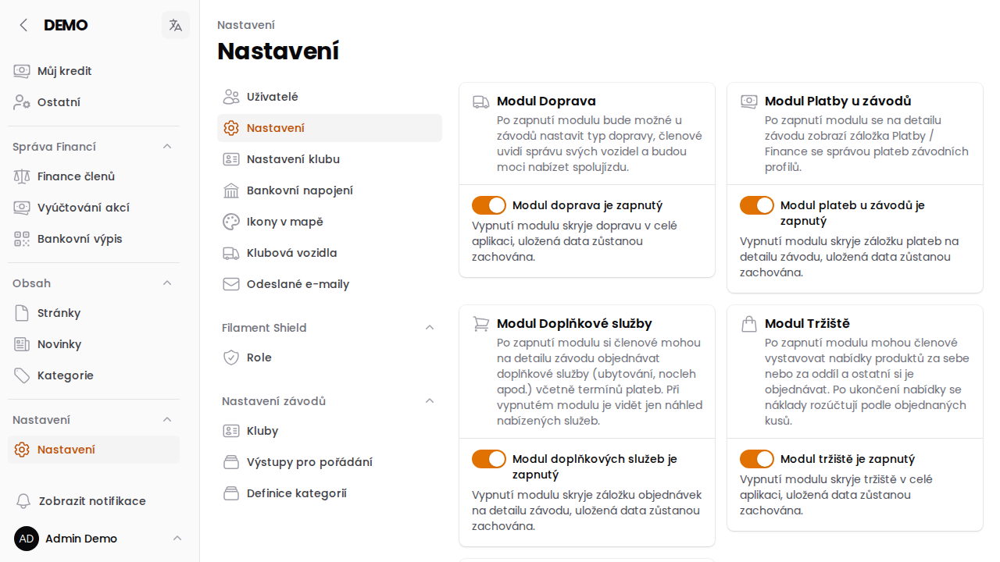

# Nastavení

Stránka **Nastavení → Nastavení** (`/admin/config/settings`) je centrální místo, kde admin klubu zapíná nebo
vypíná volitelné moduly aplikace. Vypnutý modul zmizí z menu i z celé aplikace, ale **uložená data zůstanou
zachována** — modul lze kdykoliv znovu zapnout beze ztráty.

## Volitelné moduly

- **Doprava** — u závodů jde nastavit typ dopravy, členové vidí správu svých vozidel a mohou nabízet spolujízdu. Více v [nápovědě k dopravě](/napoveda/doprava-na-zavody).
- **Platby u závodů** — na detailu závodu přibyde záložka Platby / Finance se správou plateb závodních profilů.
- **Doplňkové služby** — členové si mohou na detailu závodu objednávat doplňkové služby (ubytování, nocleh apod.)
  včetně termínů plateb.
- **Tržiště** — členové mohou vystavovat a objednávat nabídky produktů. Více v [nápovědě k Tržišti](/napoveda/trziste).
- **Napojení na banku** — automatické stahování a párování bankovních transakcí. Více v
  [nápovědě k bankovnímu napojení](/napoveda/bankovni-napojeni).
- **Mapové podklady Mapy.cz** — po zapnutí a vyplnění API klíče nabídnou mapy (přehled závodů i výběr
  GPS pozice při úpravě závodu) jako výchozí podklad Mapy.cz s možností přepnout na OpenStreetMap.

## Mapy.cz — API klíč

1. Na portálu [developer.mapy.com](https://developer.mapy.com) vytvořte API klíč.
2. V Nastavení zapněte **Podklady Mapy.cz** a klíč vložte do pole **API klíč Mapy.cz**.
3. Uložte.

:::warning{title="Omezte klíč podle domény"}
Klíč je vidět ve zdrojovém kódu veřejných stránek s mapou. V portálu Mapy.cz proto omezte jeho
použití na doménu vašeho webu.
:::

Uložený klíč se v poli znovu nezobrazí, jen jeho poslední čtyři znaky. Prázdné pole při dalším
uložení ponechá stávající klíč. Vypnutí přepínače klíč zachová, mapy pak používají jen OpenStreetMap.
Bez uloženého klíče se Mapy.cz nenabízí ani při zapnutém přepínači.
