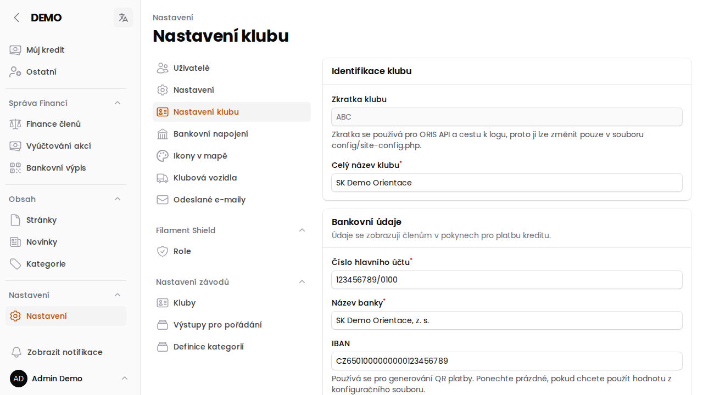

# Nastavení klubu

Stránka **Nastavení → Nastavení klubu** (`/admin/config/club`) obsahuje základní identifikaci vašeho oddílu a
bankovní údaje, které se zobrazují **členům v pokynech k platbě kreditu**.

## Identifikace klubu

- **Zkratka klubu** — používá se pro ORIS API a v cestě ke konfiguraci; needitovatelná přímo tady (jen v
  `config/site-config.php` na serveru).
- **Celý název klubu**

## Bankovní údaje

- **Číslo hlavního účtu**, **Název banky**, **IBAN** — použité pro generování QR platby na stránce
  [Finance](/napoveda/stranka-finance). IBAN lze nechat prázdný, pokud chcete použít hodnotu z konfiguračního
  souboru.

:::info{title="Nezaměňujte s Kluby"}
Tahle stránka nastavuje **váš vlastní** klub. Pod Nastavení najdete i položku **[Kluby](/napoveda/kluby)** — to je
sdílený číselník *všech* oddílů (pro párování se závodníky/závody z jiných klubů), ne nastavení vašeho oddílu.
:::
