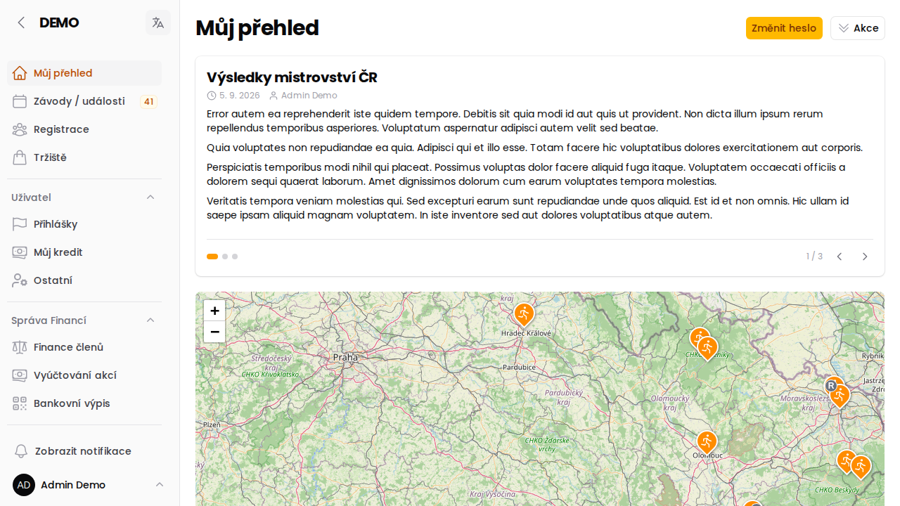
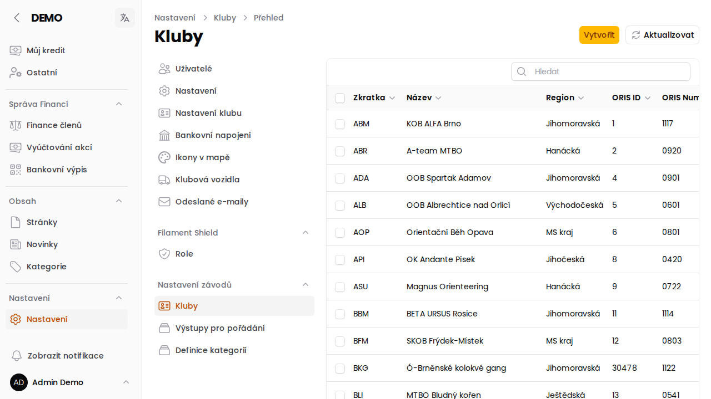
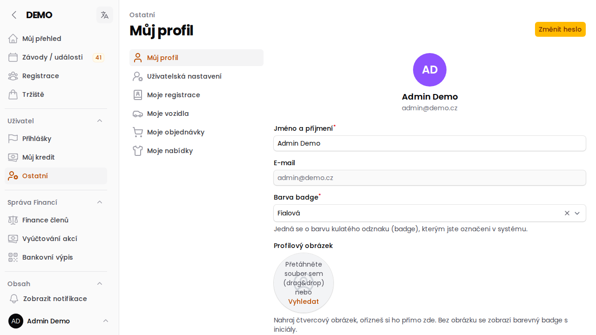

# Přechod na verzi 13

Pokud jste aplikaci naposledy používali na verzi 12 (nebo starší), přihlášení po
aktualizaci vás možná trochu překvapí — **menu vypadá jinak a je na jiném
místě**. Nic podstatného se ale neztratilo, jen se to přeskupilo a zpřehlednilo.
Tahle stránka vás provede tím, co je nové a kam se co přesunulo.

:::tip
Přihlašování na závody, platby, kredit, registrace i všechny ostatní činnosti
fungují **stejně jako dřív**. Mění se hlavně vzhled a umístění menu, ne to, co
umíte dělat.
:::

## Menu je teď celé v levém sloupci

Dřív byla nahoře samostatná lišta s vyhledáváním, zvonkem a jménem uživatele.
Ta zmizela — vešlo se to logicky do levého menu:

- **Vyhledávání** bylo zrušené úplně (nebylo konzistentní napříč aplikací).
- **Vaše jméno a odhlášení** najdete úplně dole v levém menu, ne nahoře vpravo.
- Menu je **užší** a má hustší rozvržení — na obrazovku se toho vejde víc.

## Nastavení má teď jedno místo

Tohle je nejvíc znát: věci, které bývaly rozeseté po různých částech menu
(Kluby, Uživatelé, Role, Definice kategorií, Výstupy pro pořádání...), jsou
teď pohromadě pod jednou položkou **Nastavení** úplně dole v menu.

Pokud jste zvyklí něco hledat v menu nahoře nebo v samostatné skupině, zkuste
nejdřív **Nastavení** — skoro jistě to bude tam. Podrobný rozpis, co konkrétně
kam přibylo, je v [changelogu verze 13.2](/changelog/index).

Také se přejmenovala jedna položka: **Závod** se teď jmenuje
**Závody / události** (stejná stránka, jen výstižnější název).

## Co je nového

- **Vlastní fotka a barevný odznak** — v Uživatelském nastavení (Ostatní → Můj
  profil) si můžete nahrát profilovou fotku. Bez fotky se všude zobrazuje
  barevný kroužek s vašimi iniciálami — tuhle barvu si tam taky můžete zvolit.
  Stejný odznak teď uvidíte jednotně všude, kde se dřív ukazovalo jen jméno
  (Finance, Přihlášky, Tržiště, přehled e-mailů...).

  

- **Barevné ikony na mapě** — piny závodů na mapě mají barvu podle sportu a
  malé odznaky navíc: písmenko **E** (etapový závod) nebo **R** (štafeta)
  vpravo dole, typ akce (trénink, soustředění, mistrovství klubu...) vpravo
  nahoře.
- **Živé přihlášky** — když se někdo nově přihlásí na závod, objeví se v
  tabulce přihlášek hned, není potřeba stránku ručně obnovovat.
- **Přehlednější počasí** — u závodů je víc druhů ikon počasí, takže bouřka
  vypadá jinak než déšť nebo sníh.
- Pokud váš oddíl používá **Tržiště** nebo **napojení na banku**, ty fungují
  beze změny — jen jsou teď dostupné přes stejné přehlednější menu. Podrobně
  viz [nápověda k Tržišti](/napoveda/trziste).

## Kam dál

<CardGrid columns={2}>
  <LinkCard
    icon="sparkles"
    color="orange"
    to="/changelog/index"
    title="Úplný seznam novinek"
    description="Detailní changelog verze 13.0 – 13.2 se vším, co se změnilo."
  />
  <LinkCard
    icon="users"
    color="purple"
    to="/napoveda/role-v-aplikaci"
    title="Role v aplikaci"
    description="Co která role (Člen, Správce, Redaktor...) v aplikaci vidí a smí."
  />
</CardGrid>

Pokud si nejste jistí, kde něco najít, zkuste [Úvodem](/napoveda/index) — nebo
se zeptejte správce vašeho oddílu.
