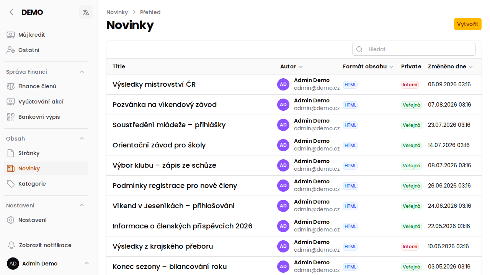
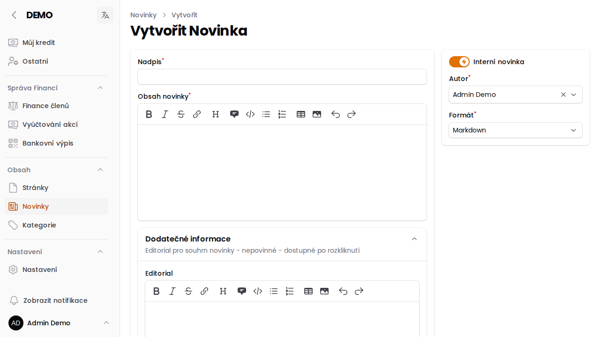

# Novinky

Redaktor spravuje **novinky** v administraci — krátké aktuální zprávy, které se zobrazují na úvodní stránce portálu (pokud jsou veřejné) nebo jen přihlášeným uživatelům v administraci (pokud jsou interní).

## Založení novinky

1. V menu **Obsah → Novinky** klikni na **Vytvořit**.
2. Vyplň **Nadpis** a **Obsah novinky** (Markdown editor s formátovací lištou).
3. Přepínačem **Interní novinka** urči viditelnost:
   - zapnuto → novinka je vidět jen přihlášeným uživatelům v administraci,
   - vypnuto → novinka je veřejná a objeví se i na úvodní stránce webu.
4. Vyber **Autora** (přednastaven je aktuálně přihlášený uživatel).
5. **Formát** obsahu je aktuálně vždy Markdown.

:::tip{title="Dodatečné informace"}
Ve sbalitelné sekci **Dodatečné informace** je možné doplnit *editorial* — kratší souhrn novinky, který se zobrazí až po rozkliknutí.
:::

## Odeslání e-mailem

U existující novinky lze z nabídky akcí (ikona tří teček) spustit **Poslat novinkovou zprávu** — rozešle obsah novinky e-mailem. U rozesílky se vybírá, jestli má jít jen uživatelům, kteří mají o novinky zájem, nebo úplně všem. Tuto akci vidí jen **Super Administrátor** a **Redaktor**.

## Vytvoření novinky přes API

Novinky lze zakládat a upravovat i strojově přes veřejné [API](/api) — endpointy `POST /api/v1/post` a `PUT /api/v1/post/{post}`. Požadavek se autentizuje hlavičkou `x-apikey` (viz [API klíč](/napoveda/stranka-uzivatelska-nastaveni#api-klíč-nově-od-verze-12)). Přístup mají role **Redaktor**, **Administrátor** a **Správce závodů**.

:::info{title="Kdo má přístup"}
Zakládat a upravovat novinky může role **Redaktor** (případně Super Administrátor). Viz [Role v aplikaci](/napoveda/role-v-aplikaci).
:::
