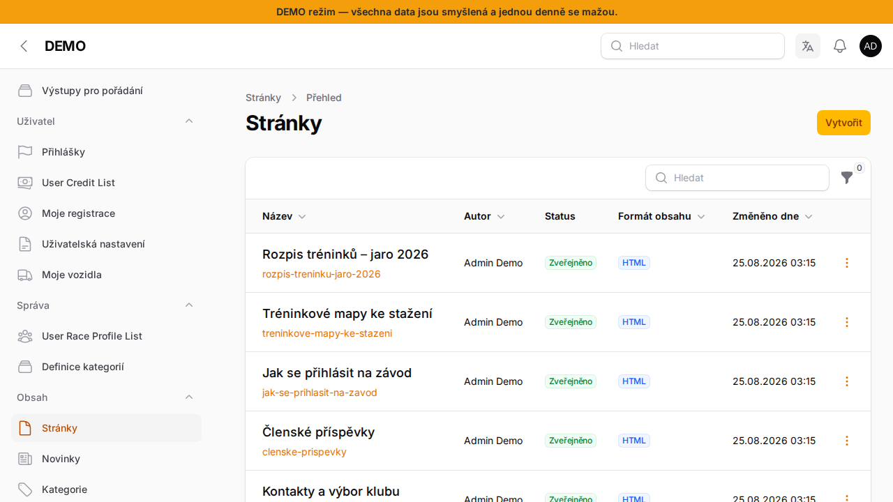
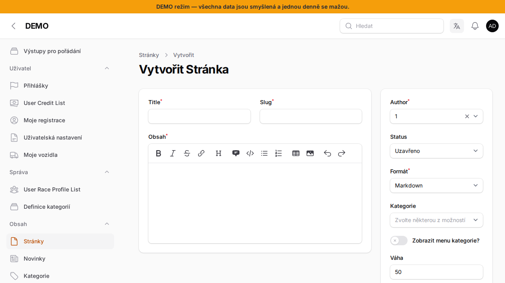

# Statické stránky

Na rozdíl od [Novinek](/napoveda/sprava-novinek), které mají charakter dočasné zprávy, jsou **stránky** trvalý obsah — pravidla klubu, informace o tréninkách, kontakty apod. Každá stránka je dostupná na veřejné adrese `/stranka/<slug>`.

## Založení stránky

1. V menu **Obsah → Stránky** klikni na **Vytvořit**.
2. Vyplň **Title** (název stránky) — **Slug** (část URL adresy) se při zakládání automaticky dopočítá z názvu, u existující stránky se sám už nemění.
3. Napiš **Obsah** — editor se přepíná podle zvoleného formátu (Markdown, nebo bohatší RichEditor s bloky, tabulkami a přílohami).
4. Vpravo nastav:
   - **Author** — autor stránky (přednastaven Redaktor),
   - **Status** — Koncept / Zveřejněno / Uzavřeno / Archivováno,
   - **Formát** — Markdown, HTML nebo RichEditor (po založení už nejde změnit),
   - **Kategorie** — volitelné zařazení do [Kategorie obsahu](/napoveda/kategorie-obsahu),
   - **Zobrazit menu kategorie?** — zapne v hlavičce stránky menu s ostatními stránkami stejné kategorie,
   - **Váha** — určuje pořadí stránky v menu kategorie (nižší číslo = výš).

:::tip{title="SEO meta údaje"}
V sekci **Meta** lze k stránce přidat libovolný počet meta tagů (`title`, `description`, `keywords`, `og:title`, `og:description`, `og:image`) pro vyhledávače a sdílení na sociálních sítích.
:::

:::info{title="Kdo má přístup"}
Zakládat a upravovat stránky může role **Redaktor** (případně Super Administrátor). Viz [Role v aplikaci](/napoveda/role-v-aplikaci).
:::
