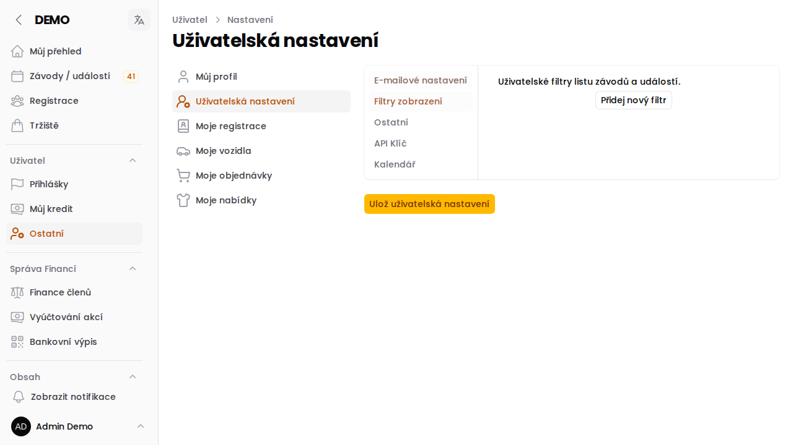

# Uživatelská nastavení

Po přihlášení se zobrazuje **nástěnka** s přehledovými kartičkami:

- **Uživatel a jeho práva** — zobrazuje vaše jméno, datum registrace, e-mail a aktuální role; odkaz na dokumentaci k rolím
- **Moje nejbližší závody** — dvě nejbližší nadcházející přihlášky na závody (datum, název, kategorie, místo); pokud žádné přihlášky nemáte, zobrazí se odkaz na seznam závodů
- **Verze aplikace** — aktuální verze aplikace a odkaz na changelog

Stránka je dále rozdělena do čtyř záložek (v levém sloupci):

- **E-mailové nastavení** — co a kdy vám systém posílá e-mailem
- **Filtry zobrazení** — vlastní záložky pro filtrování seznamu závodů
- **Ostatní** — kdo vás může přihlašovat na závody
- **API klíč** — správa klíče pro přístup k API

## E-mailové nastavení

Záložka obsahuje tři sekce nastavení e-mailových notifikací.

### Upozornění na novinky

Zapnutím volby budete dostávat e-mail při publikování nového příspěvku:

- **Novinky veřejné** — příspěvky na veřejné části webu
- **Novinky členské sekce** — příspěvky viditelné pouze přihlášeným členům

### Upozornění na blížící se konec přihlášek

Systém vám pošle e-mail, když se blíží uzávěrka přihlášek na závod. Nastavíte:

- **Sport** — pro které sporty chcete upozornění dostávat (OB, LOB, MTBO…)
- **Přibližná hodina upozornění** — v kolik hodin má e-mail přijít (0–24)
- **Dnů před ukončením přihlášek** — s jakým předstihem upozornit (1–14 dní, výchozí 4)

### Týdenní souhrn závodů

Každou neděli vám systém pošle e-mail se souhrnem závodů, u nichž končí přihlášky v následujícím týdnu. Vyberete si, které sporty má souhrn obsahovat.

## Filtry zobrazení <Badge type="tip" text="NOVĚ od verze 12" />

Vlastní filtry se zobrazí jako záložky v horní části [seznamu závodů](stranka-zavod-detail). Každý člen si může vytvořit 4 různé záložky s filtry podle svých potřeb.

### Vytvoření filtru

Klikněte na **Přidej nový filtr** a vyplňte:

| Pole | Popis |
|---|---|
| **Název** | Text, který se zobrazí jako titulek záložky (např. „Moje OB závody") |
| **Sport** | Jeden nebo více sportů (OB, LOB, MTBO, TRAIL) |
| **Typ akce** | Jeden nebo více typů závodů (závod, trénink, akce…) |
| **Ikona** | Ikona zobrazená u záložky |

Nastavení uložte tlačítkem **Uložit** ve spodní části stránky.

:::tip
Pokud nechodíte na tréninky, vytvořte si filtr pouze pro závodní typy akcí — tréninky pak uvidíte jen tehdy, když si záložku přepnete ručně.
:::



Filtry následně odpovídají nastavení v závodech. První filtr v pořadí je pak výchozí.


:::tip
Pokud smažete filtry nebo si uživatel nenastaví vlastní, bude na kartě závodů zobrazena sada výchozích filtrů.
:::

## Ostatní

### Oprávnění k přihlašování

Zde nastavíte, kteří uživatelé vás mohou **přihlašovat nebo odhlašovat** ze závodů. Hodí se pro rodinné příslušníky nebo přátele, kteří spravují registrace za vás.

Vybraní uživatelé uvidí vaši registraci v přihlašovacím formuláři závodu a budou ji moci vytvořit nebo zrušit.

Oprávnění **kdykoli odvoláte** odebráním uživatele ze seznamu a uložením nastavení.

:::tip
Pokud vám někdo toto právo přidělí, uvidíte jeho registrace v přihláškovém formuláři podbarvené **oranžově**. Stejně tak uvidíte v seznamu přihlášených oranžové tlačítko pro jeho odhlášení.
:::

## API klíč <Badge type="tip" text="NOVĚ od verze 12" />

API klíč slouží pro strojový přístup k veřejnému API systému. Klíč se používá v hlavičce HTTP požadavku:

```
x-apikey: <váš klíč>
```

### Vygenerování klíče

Pokud klíč ještě nemáte, klikněte na **Vygenerovat API klíč**. Systém klíč vytvoří a zobrazí jeho hash. Tento hash zadáváte jako hodnotu hlavičky `x-apikey`.

### Správa klíče

Pokud klíč již máte, jsou dostupné dvě akce:

- **Přegenerovat klíč** — vytvoří nový klíč; starý klíč okamžitě přestane fungovat
- **Smazat klíč** — klíč trvale odstraní; přístup přes API bude zablokován

:::warning
Hash klíče uchovávejte v tajnosti. Nesdílejte ho s nikým a nevkládejte ho do veřejných repozitářů.
:::