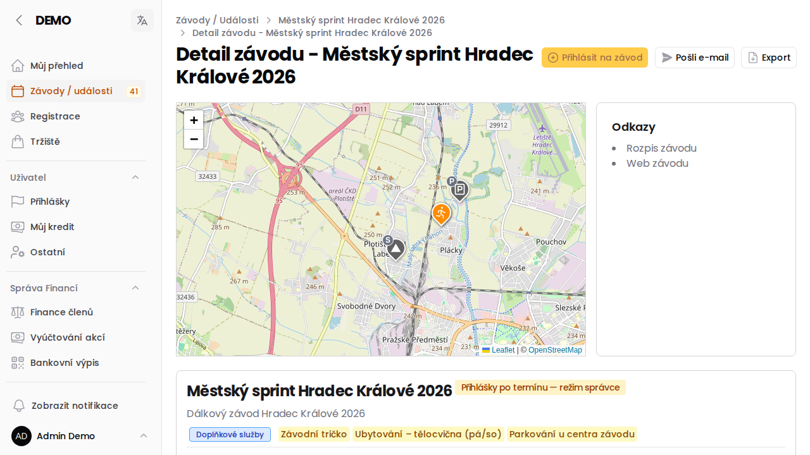

# Závody

Detail závodu zobrazuje podrobné informace vybraného závodu. Pokud se jedná o závod z ORISu, je tento detail pravidelně aktualizován.

### Co přehled zobrazuje
V závislosti na roli uživatele se mohou některé tlačítka nezobrazovat.

**V detailu je možné vidět:**

 - **situační mapu** s body zájmu, po kliknutí na body zobrazí jejich detail
 - **odkazy** - jedná se o Oris odkazy a Oris linky na dokumenty/stránky apod.
 - **přehled závodu** - kategorie, doplňkové služby odkaz na ORIS závodu, výsledky a přihlášky
 - dále jsou pravidelně stahovány novinky a může zde být popis akce
 - na spodní straně detailu závodu je vidět **žurnál přihlášek**. Přihlášení členové vidí kdo je přihlášen, v žurnálu je možné se i [odhlásit](jak-se-odhlasit-ze-zavodu).

### Žurnál přihlášek

U každé přihlášky se zobrazuje datum a čas jejího vytvoření a barevný odznak:

- 🟢 **1. termín / 2. termín / 3. termín** — přihláška vznikla v rámci daného termínu přihlášek
- 🟠 **Po termínu** — přihláška vznikla až po poslední uzávěrce

### Další záložky

- **Platby** — sloupec **Vyúčtování** vidí jen uživatelé s oprávněním k Financím členů. Odkaz **Otevřít** se zobrazí jen u závodníků, kteří mají k závodu nějakou platbu, u ostatních je „—“.
- **Doprava** — nabídky spolujízdy a žádosti o místa, viz [nápověda k dopravě](/napoveda/doprava-na-zavody).

-----

:::tip{title="Přidat závod"}
Počínaje rolí Člen mají tito uživatelé možnost se [přihlásit na závod](jak-se-prihlasit-na-oris-zavod). Pokud nejsou data aktuální, je možné aktualizaci vyvolat ručně.
:::

##### Uživatelé s vyšším oprávněním mohou
 - **přihlásit kohokoliv** z oddílu
 - **poslat informační e-mail** přihlášeným uživatelům
 - **exportovat** seznam přihlášených do *.xlsx sešitu

