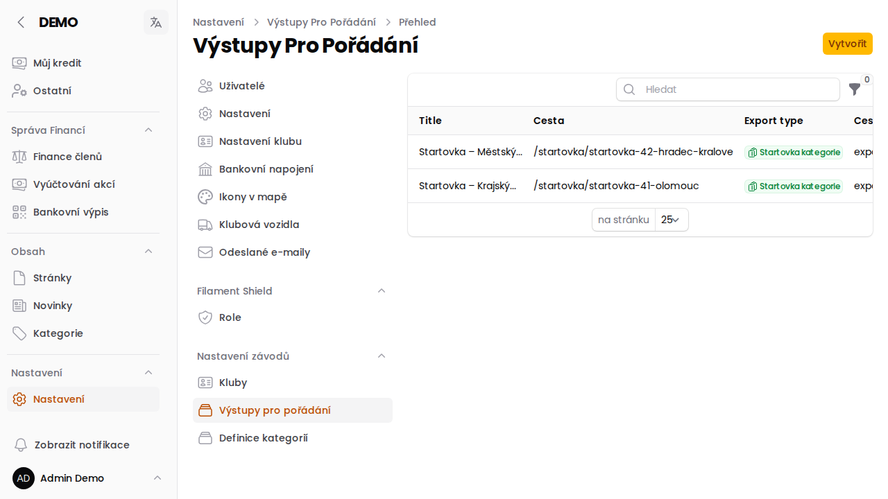

# Výstupy pro pořádání

Stránka **Nastavení → Výstupy pro pořádání** (`/admin/config/sport-event-exports`) slouží pořadatelům závodů —
zakládá **veřejné stránky se startovkou nebo výsledky** pro konkrétní závod, dostupné komukoliv bez přihlášení.

:::info{title="Nezaměňujte s exportem přihlášek"}
Tohle je jiná funkce než tlačítko **Export** na kartě závodu — to generuje jednorázový `xlsx` soubor pro sebe (viz
[Export dat ze závodu](/napoveda/jak-exportovat-data-o-zavodu)). Výstupy pro pořádání naopak vytvářejí trvalou
**veřejnou webovou stránku**.
:::

## Co záznam obsahuje

- **Title** — název výstupu (interní, pro orientaci v seznamu)
- **Typ exportu** — *Startovka kategorie* nebo *Výsledky kategorie*
- **Typ souboru** — formát nahraného souboru se startovkou/výsledky
- **Závod** — ke kterému závodu výstup patří
- **Cesta** — část URL, na které bude výstup veřejně dostupný (`/startovka/<cesta>` resp. `/vysledky/<cesta>`)

Po vytvoření záznamu a nahrání souboru je výstup ihned dostupný na veřejné adrese — stačí ji poslat účastníkům
nebo na ni odkázat, není potřeba žádné přihlášení.
